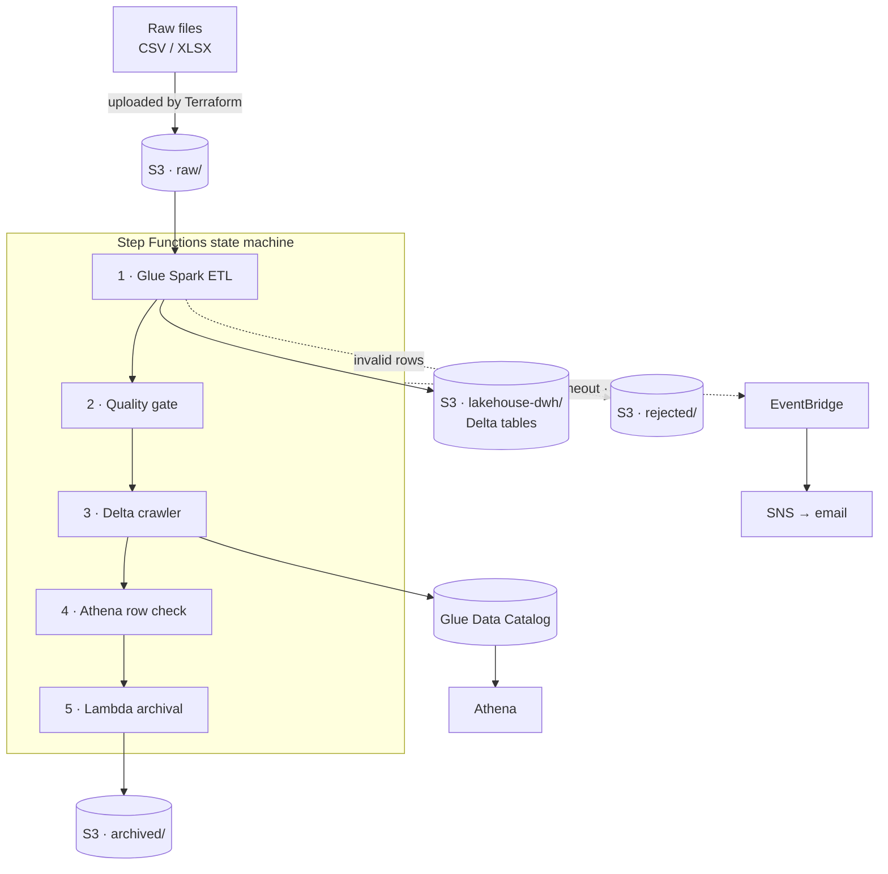

# E-Commerce Lakehouse on AWS

[](https://github.com/pierrine-bit/aws-ecommerce-lakehouse/actions/workflows/ci.yml)
[](LICENSE)
[](versions.tf)

A batch lakehouse for e-commerce transaction data, deployed end to end with
Terraform. Raw product, order, and order-item files are schema-validated,
deduplicated, and merged into ACID Delta Lake tables on S3, registered in the
Glue Data Catalog for querying through Athena, then archived once the curated
layer is verified.

---

## Architecture



Stages run sequentially, each gated on the one before it.

- **Idempotent** — `MERGE` on business keys, so replaying a batch converges
  rather than duplicating rows.
- **Fail-closed** — raw files are archived only after the curated tables are
  proven catalogued, fresh, and non-empty.
- **Auditable** — rejected rows are quarantined in `rejected/` with a reason, not
  filtered away.

---

## Data model

| Table | Merge key | Partitioned by | Referential integrity |
| ----- | --------- | -------------- | --------------------- |
| `products` | `product_id` | `department` | — |
| `orders` | `order_id` | `order_date` | — |
| `order_items` | `id` | `order_date` | `product_id` → `products`, `order_id` → `orders` |

Schemas are declared explicitly rather than inferred, so upstream drift fails at
read time instead of propagating downstream. Partitions follow the dominant query
patterns, so Athena prunes rather than scans.

---

## Pipeline

**ETL** (Glue Spark) reads each dataset against a fixed schema, normalises types,
splits valid from invalid rows on null keys and business rules, resolves
referential integrity, deduplicates, then merges into Delta and registers the
table.

**Quality gate** (Glue Python shell) asserts each table has a Delta transaction
log, a Catalog entry, and a commit no older than `max_data_age_hours`. Freshness
is the load-bearing check — presence alone would pass on a log left by an earlier
run.

**Orchestration** (Step Functions) retries Glue and Lambda tasks with backoff,
tolerates an already-running crawler, and routes every other error to a terminal
failure state that raises an alert.

---

## Deployment

Requires Terraform ≥ 1.10, AWS CLI v2, and Python 3.11 for the tests.

```bash
# 1. One-time state backend. Name must match the backend block in versions.tf.
cd bootstrap
cat > terraform.tfvars <<'EOF'
aws_region        = "eu-west-1"
state_bucket_name = "ecommerce-lakehouse-tfstate-<your-account-id>"
EOF
terraform init && terraform apply
cd ..

# 2. Deploy
cp terraform.tfvars.example terraform.tfvars
terraform init && terraform apply

# 3. Run
aws stepfunctions start-execution \
  --state-machine-arn $(terraform output -raw state_machine_arn) \
  --input file://examples/start-execution.json
```

---

## Configuration

All variables have working defaults — see [variables.tf](variables.tf). The ones
worth knowing:

| Variable | Default | Purpose |
| -------- | ------- | ------- |
| `alert_email` | `""` | Failure alerts; **none are sent while unset** |
| `max_data_age_hours` | `24` | Age at which the gate treats a table as stale |
| `crawler_enabled` / `athena_validation_enabled` | `true` | Toggle the optional stages |
| `bucket_name` | *generated* | Defaults to `<project>-<account>-<region>` |

---

## Querying

```sql
-- Daily revenue, partition-pruned on order_date
SELECT order_date,
       SUM(total_amount) AS revenue,
       COUNT(DISTINCT order_id) AS orders
FROM ecommerce_lakehouse.orders
WHERE order_date BETWEEN DATE '2025-04-01' AND DATE '2025-04-30'
GROUP BY order_date
ORDER BY order_date;
```

---

## Testing

```bash
pip install -r requirements-dev.txt
pytest -q
```

Transformation logic is separated from Glue argument resolution, so it is
testable without a live Glue context. Spark tests skip when PySpark or a JVM is
absent. CI runs the tests, then `terraform fmt -check` and `validate`.

---

## Teardown

```bash
terraform destroy
```

The state bucket carries `prevent_destroy` and survives by design — it must
outlive the environments whose state it holds. That guard binds Terraform only,
not the S3 API.

---

Licensed under the [MIT License](LICENSE).
