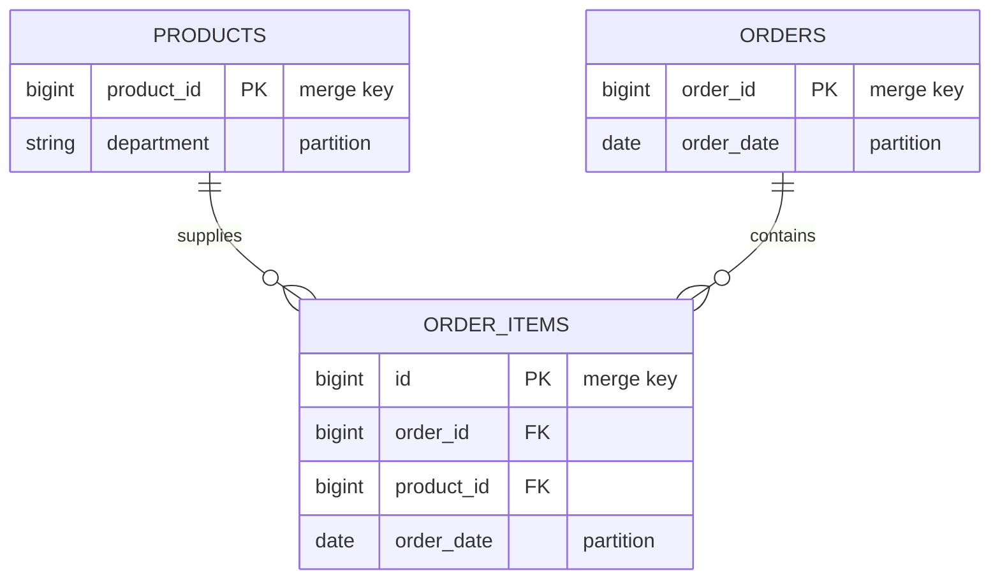

# E-Commerce Lakehouse on AWS

[](https://github.com/pierrine-bit/aws-ecommerce-lakehouse/actions/workflows/ci.yml)
[](LICENSE)
[](versions.tf)

A batch lakehouse for e-commerce transaction data, deployed end to end with
Terraform. Raw product, order, and order-item files are validated, deduplicated,
and merged into ACID Delta Lake tables on S3, catalogued for querying through
Athena.

## Architecture


- **Idempotent** — `MERGE` on business keys, so replaying a batch converges.
- **Fail-closed** — raw files archive only after the tables are proven catalogued,
  fresh, and non-empty.
- **Auditable** — invalid rows are quarantined with a reason, never dropped.

## Data model



Order items are validated against both parents, so products and orders are
processed first. Schemas are declared, not inferred.

```text
raw/                 landing zone
lakehouse-dwh/       curated Delta tables
rejected/            quarantined rows, with reason
archived/            consumed raw files, timestamped
scripts/             job code
athena-results/      query output
```

## Pipeline

**ETL** — Glue Spark. Coerces types, splits valid from invalid rows, checks
referential integrity, deduplicates on the merge key, merges into Delta.

| Dataset | Rejected when |
| ------- | ------------- |
| `products` | `product_id` is null |
| `orders` | `order_id` or `user_id` null · `order_timestamp` unparseable · `total_amount` null or negative |
| `order_items` | any key null · `order_timestamp` unparseable · `days_since_prior_order` negative · `product_id` or `order_id` unresolved |

**Quality gate** — every table must have a Delta transaction log, a Catalog entry,
and a commit newer than `max_data_age_hours`. Freshness is the load-bearing check:
presence alone passes on a log left by an earlier run.

**Failure handling** — Glue and Lambda retry with backoff; anything else routes to
a terminal failure state. EventBridge publishes pipeline and Glue job failures to
SNS. The ETL logs read, rejected, and written counts per dataset.

## Security

- Three scoped IAM roles; the archival Lambda has no access to curated data
- SSE-S3 encryption, versioning, and a public-access block; state encrypted and
  locked

## Deployment

Requires Terraform ≥ 1.10 and AWS CLI v2. The state bucket name is hard-coded in
[versions.tf](versions.tf) — set it and `state_bucket_name` to the same globally
unique value first, or step 2 fails to initialise.

```bash
# 1. One-time state backend
cd bootstrap
cat > terraform.tfvars <<'EOF'
aws_region        = "eu-west-1"
state_bucket_name = "ecommerce-lakehouse-tfstate-<your-account-id>"
EOF
terraform init && terraform apply
cd ..

# 2. Deploy
cp terraform.tfvars.example terraform.tfvars
terraform init && terraform apply

# 3. Run
ARN=$(aws stepfunctions start-execution \
  --state-machine-arn $(terraform output -raw state_machine_arn) \
  --input file://examples/start-execution.json \
  --query executionArn --output text)

aws stepfunctions describe-execution --execution-arn $ARN --query status
```

Re-running is safe, but archival empties the raw zone — restore from
`archived/<timestamp>/` to reprocess a batch.

## Configuration

Defaults work unmodified; see [variables.tf](variables.tf).

| Variable | Default | Purpose |
| -------- | ------- | ------- |
| `alert_email` | `""` | Failure alerts; **none are sent while unset** |
| `max_data_age_hours` | `24` | Age at which the gate treats a table as stale |
| `crawler_enabled` / `athena_validation_enabled` | `true` | Toggle the optional stages |

## Querying

Use the `ecommerce-lakehouse-athena` workgroup, which enforces its own results
location.

```sql
SELECT order_date, SUM(total_amount) AS revenue
FROM ecommerce_lakehouse.orders
GROUP BY order_date
ORDER BY order_date;
```

## Testing

```bash
pip install -r requirements-dev.txt
pytest -q
```

Job logic is separated from Glue argument resolution, so it tests without a live
Glue context. Spark tests skip without a JVM. CI runs the tests, then
`terraform fmt -check` and `validate`.

## Teardown

```bash
terraform destroy
```

The Athena workgroup needs `force_destroy` — query history makes it non-empty. The
state bucket keeps `prevent_destroy` and is removed deliberately, not by
`destroy`.

## Repository layout

```text
bootstrap/           one-time S3 backend for Terraform state
data/                source datasets
examples/            sample state machine input
glue_scripts/        Spark ETL and quality-gate jobs
lambda/              archival handler
tests/               unit tests for both job modules
alerts.tf            SNS topic and EventBridge failure rules
glue.tf              Glue jobs, Catalog database, crawler, Athena workgroup
iam.tf               least-privilege roles and policies
lambda.tf            archival function
main.tf              S3 bucket, hardening, lifecycle rules, data uploads
outputs.tf           bucket, database, workgroup, state machine ARN
step_functions.tf    state machine definition
variables.tf         input variables
versions.tf          provider constraints and S3 backend
```

## Known limitations

- Batch ingestion, manually triggered
- XLSX parsed on the Spark driver, so bounded by driver memory
- The gate checks presence and freshness, not distributions
- Delta `OPTIMIZE` and `VACUUM` are unscheduled
