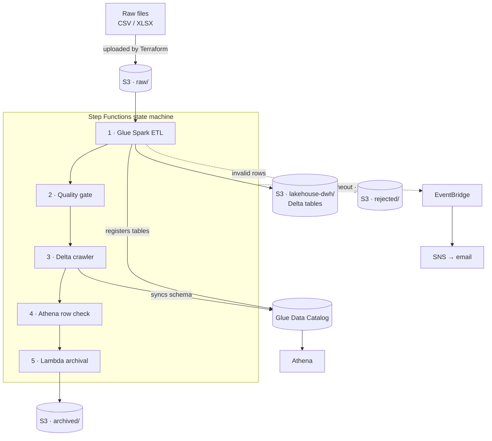
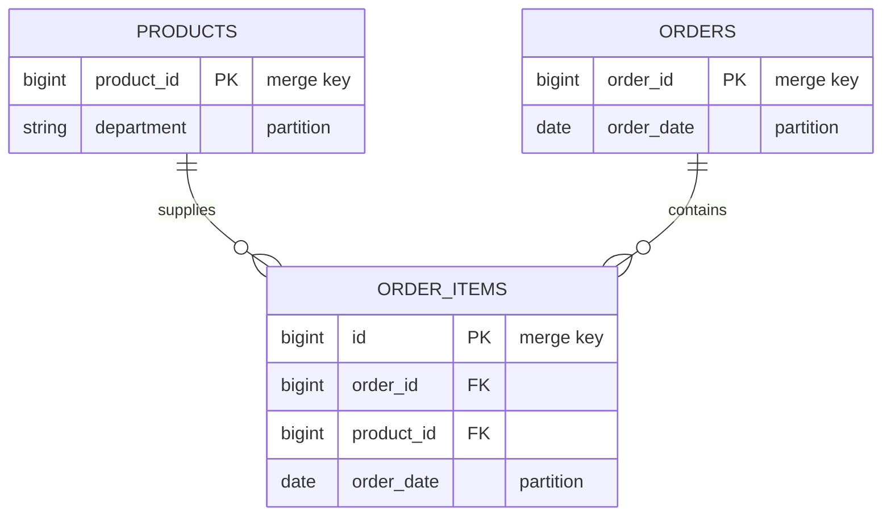

# E-Commerce Lakehouse on AWS

[](https://github.com/pierrine-bit/aws-ecommerce-lakehouse/actions/workflows/ci.yml)
[](LICENSE)
[](versions.tf)

A batch lakehouse for e-commerce transaction data, deployed end to end with
Terraform. Raw product, order, and order-item files are schema-validated,
deduplicated, and merged into ACID Delta Lake tables on S3, registered in the
Glue Data Catalog for querying through Athena, then archived once the curated
layer is verified.

---

## Architecture



Stages run sequentially, each gated on the one before it.

- **Idempotent** — `MERGE` on business keys, so replaying a batch converges
  rather than duplicating rows.
- **Fail-closed** — raw files are archived only after the curated tables are
  proven catalogued, fresh, and non-empty.
- **Auditable** — rejected rows are quarantined in `rejected/` with a reason, not
  filtered away.

---

## Data model



Order items are validated against both parents; rows whose `product_id` or
`order_id` does not resolve are quarantined rather than loaded, which is why the
ETL processes products and orders first.

Schemas are declared explicitly rather than inferred, so upstream drift fails at
read time instead of propagating downstream. Partitions follow the dominant query
patterns, so Athena prunes rather than scans.

---

## Pipeline

**ETL** — Glue 4.0 Spark on two `G.1X` workers. Reads each dataset against a
fixed schema, normalises types so unparseable numerics become SQL `NULL` rather
than `NaN`, splits valid from invalid rows, resolves referential integrity,
deduplicates on the merge key, then merges into Delta and registers the table.

| Dataset | Rejected when |
| ------- | ------------- |
| `products` | `product_id` is null |
| `orders` | `order_id` or `user_id` null · `order_timestamp` unparseable · `total_amount` null or negative |
| `order_items` | any key null · `order_timestamp` unparseable · `days_since_prior_order` negative · `product_id` or `order_id` unresolved |

A null `days_since_prior_order` is valid — it marks a customer's first order — so
only negative values are rejected.

**Quality gate** — a 1-DPU Glue Python shell job asserting each table has a Delta
transaction log, a Catalog entry, and a commit no older than
`max_data_age_hours`. Freshness is the load-bearing check: presence alone would
pass on a log left by an earlier run, even if today's wrote nothing.

**Orchestration** (Step Functions) retries Glue and Lambda tasks with backoff,
tolerates an already-running crawler, and routes every other error to a terminal
failure state that raises an alert.

**Alerting** — two EventBridge rules publish to an SNS topic: one for the state
machine entering `FAILED`, `TIMED_OUT`, or `ABORTED`, and one for either Glue job
failing or timing out, whether the pipeline invoked it or someone ran it by hand.
The second rule matters because a manually triggered job failure would otherwise
be silent.

---

## Security

Three narrowly scoped IAM roles — Glue, Lambda, and Step Functions — rather than
one shared role, each limited to the S3 prefixes, Catalog resources, and job ARNs
it needs. The archival Lambda can read and delete only under `raw/` and write only
under `archived/`, so it has no access to curated data at all. Athena executes as
the Step Functions role, which is what carries the Catalog read and results-write
permissions.

The lakehouse bucket enforces SSE-S3 encryption, versioning, and a full
public-access block. Terraform state is likewise encrypted, versioned, and locked.

---

## Deployment

Requires Terraform ≥ 1.10, AWS CLI v2, and Python 3.11 for the tests.

Terraform forbids variables in `backend` blocks, so the state bucket name is
hard-coded in [versions.tf](versions.tf). **Set it and `state_bucket_name` below
to the same globally unique value before deploying**, or step 2 will fail to
initialise.

```bash
# 1. One-time state backend
cd bootstrap
cat > terraform.tfvars <<'EOF'
aws_region        = "eu-west-1"
state_bucket_name = "ecommerce-lakehouse-tfstate-<your-account-id>"
EOF
terraform init && terraform apply
cd ..

# 2. Deploy the lakehouse
cp terraform.tfvars.example terraform.tfvars
terraform init && terraform apply

# 3. Run the pipeline
ARN=$(aws stepfunctions start-execution \
  --state-machine-arn $(terraform output -raw state_machine_arn) \
  --input file://examples/start-execution.json \
  --query executionArn --output text)

# 4. Follow it to completion
aws stepfunctions describe-execution --execution-arn $ARN \
  --query '{status:status, stopDate:stopDate}'
```

A first run takes several minutes, most of it Glue cluster start-up. `status`
moves from `RUNNING` to `SUCCEEDED`; anything else means a stage failed and the
Step Functions execution history names which.

---

## Configuration

All variables have working defaults — see [variables.tf](variables.tf). The ones
worth knowing:

| Variable | Default | Purpose |
| -------- | ------- | ------- |
| `alert_email` | `""` | Failure alerts; **none are sent while unset** |
| `max_data_age_hours` | `24` | Age at which the gate treats a table as stale |
| `crawler_enabled` / `athena_validation_enabled` | `true` | Toggle the optional stages |
| `bucket_name` | *generated* | Defaults to `<project>-<account>-<region>` |

Disabling a stage removes it from the state machine rather than skipping it, so
the deployed definition always reflects what actually runs. `terraform.tfvars` is
gitignored, keeping account-specific values out of version control.

---

## Querying

Run against the `ecommerce-lakehouse-athena` workgroup, which enforces its own
results location — queries issued from the default `primary` workgroup will write
results elsewhere.

```sql
-- Daily revenue, partition-pruned on order_date
SELECT order_date,
       SUM(total_amount) AS revenue,
       COUNT(DISTINCT order_id) AS orders
FROM ecommerce_lakehouse.orders
WHERE order_date BETWEEN DATE '2025-04-01' AND DATE '2025-04-30'
GROUP BY order_date
ORDER BY order_date;
```

---

## Testing

```bash
pip install -r requirements-dev.txt
pytest -q
```

Transformation logic is separated from Glue argument resolution, so it is
testable without a live Glue context. The suite covers type coercion, the
valid/invalid split for every business rule, and the gate's freshness logic
against mocked S3 and Glue clients. Spark tests skip when PySpark or a JVM is
absent, so the suite stays runnable locally and executes in full in CI.

CI runs the tests first — a logic regression fails fast — then
`terraform fmt -check`, `init -backend=false`, and `validate`.

---

## Teardown

Run from the repo root; `bootstrap/` is a separate configuration and is left
untouched.

```bash
terraform destroy
```

Two constraints, both encoded in the configuration:

- **Athena workgroups need recursive deletion.** Query-execution history makes a
  workgroup non-empty and AWS refuses to delete it, so `force_destroy = true` is
  set on the resource.
- **The state bucket survives by design.** It carries `prevent_destroy` because it
  must outlive the environments whose state it holds. That guard binds Terraform
  only, not the S3 API — and since the bucket has versioning without
  `force_destroy`, every object version must be removed before it can be deleted
  at all.

---

## Known limitations

Ingestion is batch and manually triggered; an S3 notification or schedule would
make it event-driven. XLSX parsing happens on the Spark driver, so it does not
scale beyond driver memory — converting sources to CSV or Parquet upstream would
remove the ceiling. The state bucket name is hard-coded, as Terraform forbids
variables in `backend` blocks. The quality gate validates presence and freshness
but not distributions; column profiling would deepen it. Delta `OPTIMIZE` and
`VACUUM` are unscheduled, so small files accumulate across many incremental runs.
