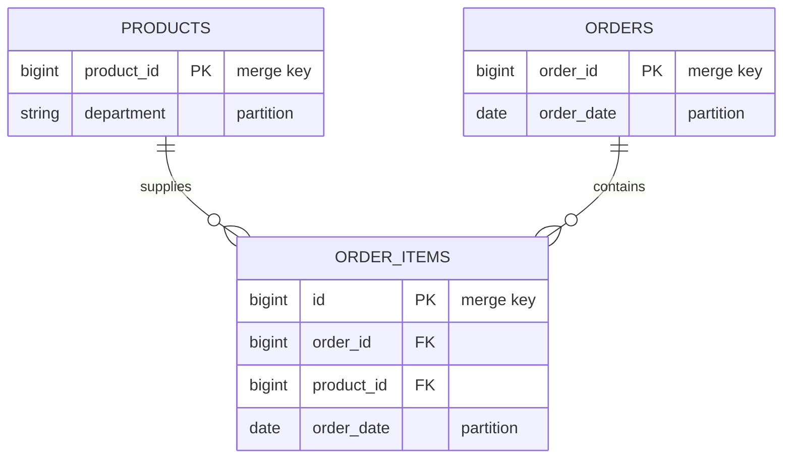

# E-Commerce Lakehouse on AWS

[](https://github.com/pierrine-bit/aws-ecommerce-lakehouse/actions/workflows/ci.yml)
[](LICENSE)
[](versions.tf)

A batch lakehouse for e-commerce transaction data, deployed end to end with
Terraform. Raw product, order, and order-item files are schema-validated,
deduplicated, and merged into ACID Delta Lake tables on S3, registered in the
Glue Data Catalog for querying through Athena.

## Architecture


Stages run sequentially, each gated on the one before it.

| Stage | Service | Purpose |
| ----- | ------- | ------- |
| 1 · ETL | Glue Spark | Validate, deduplicate, merge into Delta tables |
| 2 · Quality gate | Glue Python shell | Prove the tables exist, are catalogued, and are fresh |
| 3 · Crawler | Glue Delta crawler | Keep Catalog schemas in step with the tables |
| 4 · Row check | Athena | Confirm every table is non-empty |
| 5 · Archival | Lambda | Move consumed raw files out of the landing zone |

**Design guarantees**

- **Idempotent** — `MERGE` on business keys, so replaying a batch converges
  rather than duplicating rows.
- **Fail-closed** — raw files are archived only after the curated tables are
  proven catalogued, fresh, and non-empty.
- **Auditable** — invalid rows are quarantined with a rejection reason and
  timestamp, never silently dropped.

## Data model



- Order items are validated against both parents — hence products and orders are
  processed first.
- Schemas are declared, not inferred, so upstream drift fails at read time.
- Partitions match the dominant query patterns, so Athena prunes rather than scans.

## Pipeline

**ETL** — Glue 4.0 Spark, two `G.1X` workers.

- Coerces types so unparseable numerics become SQL `NULL`, not `NaN`
- Splits valid from invalid rows, then checks referential integrity
- Deduplicates on the merge key, merges into Delta, registers the table

| Dataset | Rejected when |
| ------- | ------------- |
| `products` | `product_id` is null |
| `orders` | `order_id` or `user_id` null · `order_timestamp` unparseable · `total_amount` null or negative |
| `order_items` | any key null · `order_timestamp` unparseable · `days_since_prior_order` negative · `product_id` or `order_id` unresolved |

`days_since_prior_order` may be null — a customer's first order — so only negative
values reject.

**Quality gate** — 1-DPU Glue Python shell job. Every table must have a Delta
transaction log, a Catalog entry, and a commit newer than `max_data_age_hours`.
Freshness is the load-bearing check: presence alone passes on a log left by an
earlier run.

**Orchestration** — retries Glue and Lambda with backoff, tolerates an
already-running crawler, routes all other errors to a terminal failure state.

**Alerting** — two EventBridge rules publish to SNS:

- pipeline enters `FAILED`, `TIMED_OUT`, or `ABORTED`
- either Glue job hits `FAILED` or `TIMEOUT`, manual runs included

**Observability** — 14-day CloudWatch log groups for Glue and Step Functions,
which logs at `ALL` with execution data. The ETL logs read, rejected, and written
counts per dataset, so a run's lineage is reconstructable from logs alone.

## Security

- Three scoped IAM roles — Glue, Lambda, Step Functions — not one shared role,
  each limited to the prefixes, Catalog resources, and job ARNs it needs
- The archival Lambda reads and deletes only under `raw/` and writes only under
  `archived/`, so it has no access to curated data
- SSE-S3 encryption, versioning, and a full public-access block on the bucket
- Terraform state encrypted, versioned, and locked

## Deployment

Requires Terraform ≥ 1.10, AWS CLI v2, and Python 3.11 for the tests.

Terraform forbids variables in `backend` blocks, so the state bucket name is
hard-coded in [versions.tf](versions.tf). **Set it and `state_bucket_name` below
to the same globally unique value before deploying**, or step 2 will fail to
initialise.

```bash
# 1. One-time state backend
cd bootstrap
cat > terraform.tfvars <<'EOF'
aws_region        = "eu-west-1"
state_bucket_name = "ecommerce-lakehouse-tfstate-<your-account-id>"
EOF
terraform init && terraform apply
cd ..

# 2. Deploy the lakehouse
cp terraform.tfvars.example terraform.tfvars
terraform init && terraform apply

# 3. Run the pipeline
ARN=$(aws stepfunctions start-execution \
  --state-machine-arn $(terraform output -raw state_machine_arn) \
  --input file://examples/start-execution.json \
  --query executionArn --output text)

# 4. Follow it to completion
aws stepfunctions describe-execution --execution-arn $ARN --query status
```

A first run takes several minutes, most of it Glue cluster start-up. `status`
moves from `RUNNING` to `SUCCEEDED`; anything else means a stage failed and the
execution history names which.

Re-running is safe, but a successful run archives the raw zone — re-processing the
same batch means restoring the files from `archived/<timestamp>/` first.

## Configuration

All variables have working defaults — see [variables.tf](variables.tf). The ones
worth knowing:

| Variable | Default | Purpose |
| -------- | ------- | ------- |
| `alert_email` | `""` | Failure alerts; **none are sent while unset** |
| `max_data_age_hours` | `24` | Age at which the gate treats a table as stale |
| `crawler_enabled` / `athena_validation_enabled` | `true` | Toggle the optional stages |

Disabling a stage removes it from the state machine rather than skipping it.
`terraform.tfvars` is gitignored, keeping account-specific values out of version
control.

## Querying

Run against the `ecommerce-lakehouse-athena` workgroup, which enforces its own
results location — queries from the default `primary` workgroup write results
elsewhere.

```sql
SELECT order_date,
       SUM(total_amount) AS revenue,
       COUNT(DISTINCT order_id) AS orders
FROM ecommerce_lakehouse.orders
WHERE order_date BETWEEN DATE '2025-04-01' AND DATE '2025-04-30'
GROUP BY order_date
ORDER BY order_date;
```

## Testing

```bash
pip install -r requirements-dev.txt
pytest -q
```

- Transformation logic is separated from Glue argument resolution, so it runs
  without a live Glue context
- Covers type coercion, every business rule's valid/invalid split, and the gate's
  freshness logic against mocked S3 and Glue clients
- Spark tests skip without PySpark or a JVM; CI installs both and runs them in full
- CI order: tests first, so a logic regression fails fast, then
  `terraform fmt -check`, `init -backend=false`, and `validate`

## Teardown

Run from the repo root; `bootstrap/` is separate and left untouched.

```bash
terraform destroy
```

Two constraints, both encoded in the configuration:

- **Athena workgroups need recursive deletion.** Query-execution history makes a
  workgroup non-empty, so `force_destroy = true` is set on the resource.
- **The state bucket survives by design.** `prevent_destroy` keeps it outliving
  the environments whose state it holds. That guard binds Terraform only, not the
  S3 API, and with versioning enabled every object version must be removed before
  the bucket can be deleted.

## Known limitations

- Ingestion is batch and manually triggered; an S3 notification or schedule would
  make it event-driven.
- XLSX parsing happens on the Spark driver, so it does not scale beyond driver
  memory.
- The quality gate validates presence and freshness, not distributions.
- Delta `OPTIMIZE` and `VACUUM` are unscheduled, so small files accumulate across
  many incremental runs.
